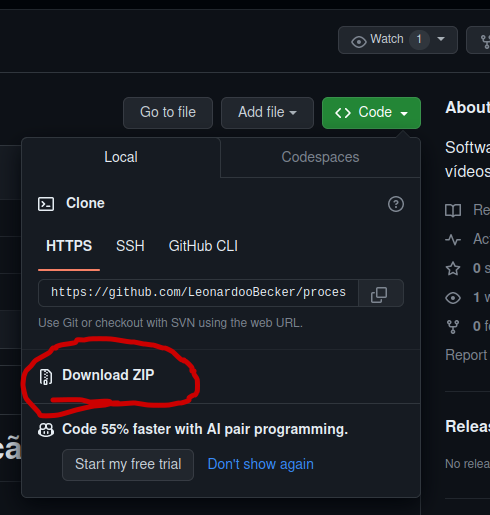

# Estudo Naturalístico de Direção Brasileira.

# Objetivo

-   Este software foi desenvolvido para atender dois principais objetivos:
    - Realizar a concatenação dos vídeos obtidos pela plataforma de coleta.
    - Realizar os cortes no arquivo txt que contém os dados geográficos das gravações, separando pelas respectivas viagens.

# Formatação da pasta para funcionamento correto do código

Para que o software consiga realizar seu processamento com exito é necessário que as pastas obtidas pela plataforma sigam o seguinte formato:

1.  Diretório principal ( raiz do HD ), local onde é possível observar todos os condutores contidos no HD:
    1.  No diretório principal, é necessário que todas as pastas de condutores possuam o nome com a formatação `"Driver XX"`
       
    
2. Diretório condutor:
   1. Dentro das pastas dos condutores, devem estar localizados somente os Cards do respectivo condutor, cujo nome deve seguir a seguinte formatação `"Card (número)"`

3. Diretório card:
   1. Dentro da pasta de cada Card deve conter para utilização os seguintes elementos:
      1. **Back** - Pasta que contém todos os vídeos particionados em 3 minutos obtidos pela câmera traseira da plataforma. 
      2. **Front** - Pasta que contém todos os vídeos particionados em 3 minutos obtidos pela câmera frontal da plataforma.
      3. **GPSData000001.txt** - Arquivo txt que contém os dados geográficos registrados pela câmera.
         
        **Detalhe:** todos os arquivos/pastas presentes no HD, que não sejam as 3 anteriormente descritas, serão **__ignoradas__**, mas caso um dos 3 elementos não esteja presente, o programa **não executa**.


# Obtenção do software

Para a utilização do software, primeiramente é necessário ter o mesmo em sua máquina local, do qual isso pode ser feito de duas maneiras distintas:
1.    Baixando o arquivo ZIP disponibilizado neste próprio repositório, em seguida fazer a descompactação do mesmo em sua máquina local.
  
  
  
2.    Clonando o repositório com o comando:
```
git clone git@github.com:CarlosASouto/IC-Transportes.git
```

Independente da forma adotada, estamos interessados no script `processaDados.py` e a pasta `local_libs`, estes dois arquivos devem ser copiados para o diretório raiz do HD.


# Execução do programa

Considerando que o script python `processaDados.py` e a pasta `local_libs` estão presentes no ditetório raiz do HD, o programa pode ser executado das seguintes maneiras: 

1.  Forma geral:
   ```python
    python3 processaDados.py ./
   ```
   Executando o programa desta maneira, o processo padrão ( concatenção e seccionamento ) será executado para todas as pastas `"Driver XX"` presentes no diretório, ou seja, ao final da execução, o HD terá os vídeos concatenados e seus respectivos arquivos GPS para todos os Condutores presentes no HD.

2.  Forma singular:
    ```python
     python3 processaDados.py XX
    ```
    Executando o programa desta maneira, o processo padrão ( concatenção e seccionamento ) será executado exclusivamente para o `"Driver XX"` passado por parâmetro, ou seja, ao final da execução, apenas o `"Driver XX"` terá seus vídeos concatenados e seus respectivos arquivos GPS.

**Lembrando** - Para executar qualquer um dos dois comandos descritos acima, com a pasta do HD aberto, basta clicar com o botão direito e escolher "Abrir no terminal"
